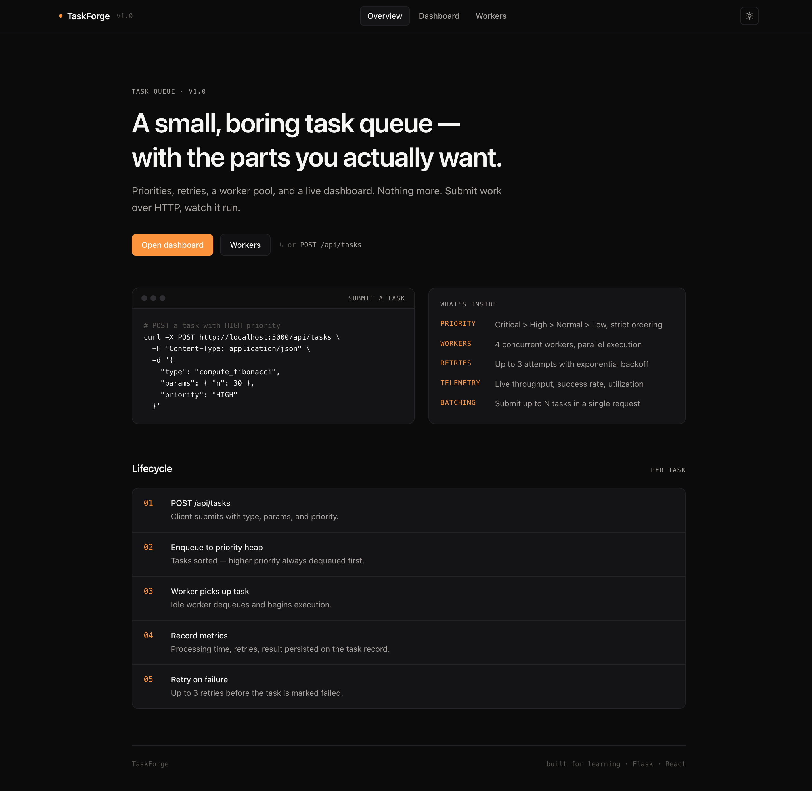
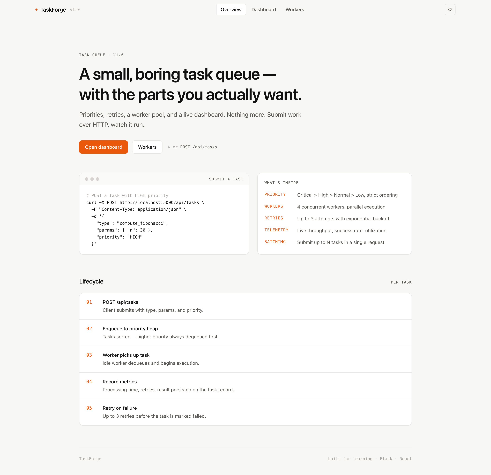
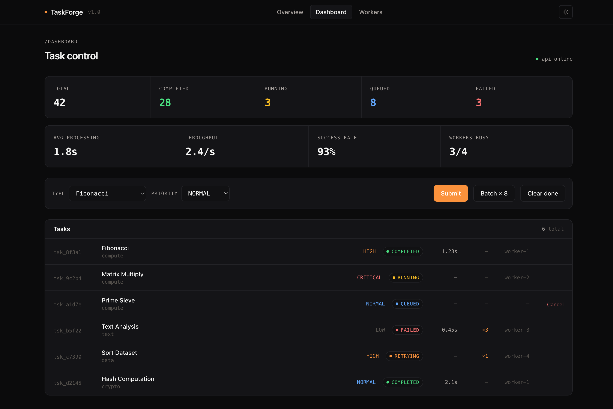
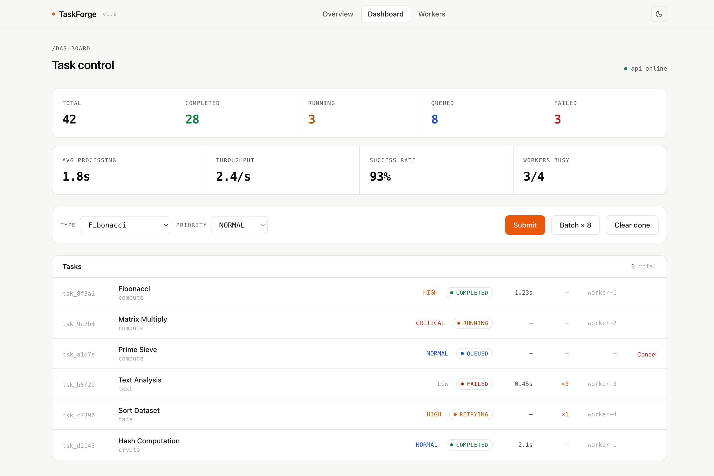
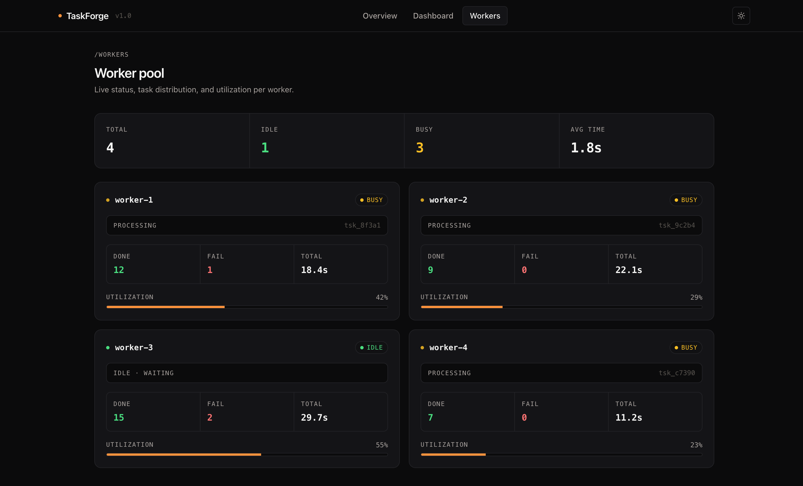
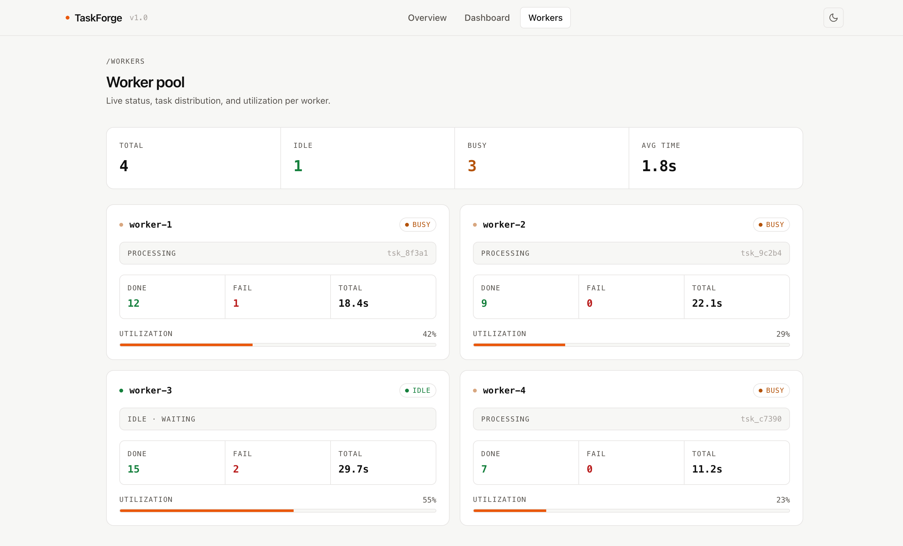

# TaskForge - Distributed Task Queue System

A multi-worker distributed task processing system with priority queuing, fault tolerance, automatic retries, and real-time monitoring dashboard.

**Live Demo:** [https://taskforge-ten.vercel.app](https://taskforge-ten.vercel.app)

## Screenshots

The UI ships with a light/dark theme toggle in the navbar. Both are captured below at 1440px.

### Landing page

| Dark | Light |
|------|-------|
|  |  |

Includes a working `curl` example for `POST /api/tasks`, a summary of capabilities, and the per-task lifecycle.

### Dashboard

| Dark | Light |
|------|-------|
|  |  |

Live stats (`total`, `completed`, `running`, `queued`, `failed`), performance metrics (`avg processing`, `throughput`, `success rate`, `workers busy`), a submit form, and a task list with click-to-copy IDs.

### Workers

| Dark | Light |
|------|-------|
|  |  |

Per-worker status, currently processing task (click to copy), task counts, and utilization bar.

## Features

- **Priority Queue** - Tasks processed by priority: Critical > High > Normal > Low
- **Multi-Worker Pool** - 4 concurrent worker threads process tasks in parallel
- **Fault Tolerance** - Simulated 10% failure rate with automatic retry (up to 3 attempts)
- **8 Task Types** - Fibonacci, matrix multiplication, prime sieve, sorting, text analysis, I/O simulation, hashing, data aggregation
- **Batch Processing** - Submit multiple tasks at once for parallel execution
- **Real-Time Dashboard** - Live monitoring with auto-refresh every 2 seconds
- **Worker Analytics** - Per-worker stats: completed, failed, processing time, utilization
- **Task Lifecycle** - Full tracking: queued → running → completed/failed/retrying

## Tech Stack

### Backend
- **Python 3** - Core language
- **Flask** - REST API
- **Flask-SocketIO** - WebSocket support for real-time updates
- **Threading** - Multi-worker concurrent processing

### Frontend
- **React 19** - UI framework
- **Vite** - Build tool
- **Tailwind CSS 4** - Styling
- **Framer Motion** - Animations

## Getting Started

### Backend

```bash
cd backend
python -m venv venv
source venv/bin/activate
pip install -r requirements.txt
python app.py
```

Server runs on `http://localhost:5300`

### Frontend

```bash
cd frontend
npm install
npm run dev
```

Frontend runs on `http://localhost:5173`

## API Endpoints

| Endpoint | Method | Description |
|----------|--------|-------------|
| `/api/health` | GET | Health check |
| `/api/tasks` | GET | List all tasks (filter by ?status=) |
| `/api/tasks` | POST | Submit a new task |
| `/api/tasks/batch` | POST | Submit multiple tasks |
| `/api/tasks/:id` | GET | Get task details |
| `/api/tasks/:id/cancel` | POST | Cancel a queued task |
| `/api/tasks/clear` | POST | Clear completed/failed tasks |
| `/api/workers` | GET | Get worker pool status |
| `/api/stats` | GET | Get system statistics |
| `/api/task-types` | GET | List available task types |

## Architecture

```
Client (REST API)
    ↓
Priority Queue (Critical → High → Normal → Low)
    ↓
┌─────────────────────────────────┐
│  Worker Pool (4 threads)        │
│  ┌──────┐ ┌──────┐ ┌──────┐   │
│  │ W-1  │ │ W-2  │ │ W-3  │...│
│  └──────┘ └──────┘ └──────┘   │
└─────────────────────────────────┘
    ↓
Results + Metrics → Dashboard
```

## Task Types

| Task | Category | Description |
|------|----------|-------------|
| Fibonacci | Computation | Calculate nth Fibonacci number |
| Matrix Multiply | Computation | NxN matrix multiplication |
| Prime Sieve | Computation | Sieve of Eratosthenes |
| Sort Dataset | Data Processing | Merge sort on random data |
| Text Analysis | Data Processing | Word frequency analysis |
| Simulate I/O | I/O | Simulated async I/O delay |
| Hash Computation | Security | Hash chain computation |
| Data Aggregation | Data Processing | Statistical aggregation |

## Project Structure

```
TaskForge/
├── backend/
│   ├── app.py            # Flask API + WebSocket server
│   ├── task_queue.py     # Core: DistributedTaskQueue, Worker, task executors
│   ├── config.py         # Configuration
│   └── requirements.txt
├── frontend/
│   ├── src/
│   │   ├── pages/
│   │   │   ├── Home.jsx       # Landing page
│   │   │   ├── Dashboard.jsx  # Task monitoring + submission
│   │   │   └── Workers.jsx    # Worker pool status
│   │   ├── components/
│   │   │   └── Navbar.jsx
│   │   ├── App.jsx
│   │   ├── main.jsx
│   │   └── index.css
│   └── package.json
└── README.md
```

## License

MIT
